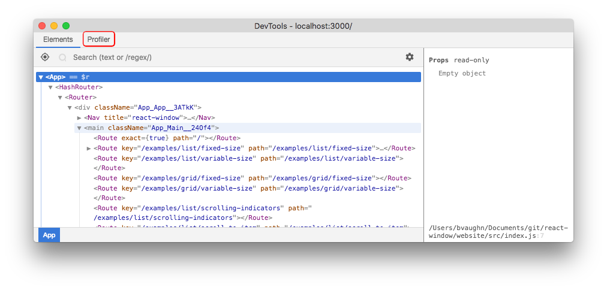

How do I format text in markdown?

# Title

## Heading 1
### Heading 2
#### Heading 3

Normal text.
<br>
**Bold text.**
<br>
*Italic.*
<br>
`Highlight text.`
<br>
[Link](https://google.com)

List:
* First item.
* Second item.
* Third item.

```
Highligh a paragraph.
```

>Note
>
>This is a note.

Twitter-tweet:
<blockquote class="twitter-tweet" data-conversation="none" data-dnt="true"><p lang="en" dir="ltr">working here... thanks for all the new functionality 👍</p>&mdash; Stephen Haney (@sdothaney) <a href="https://twitter.com/sdothaney/status/1046822703116607490?ref_src=twsrc%5Etfw">October 1, 2018</a></blockquote>

Image:


Video from youtube:
<iframe width="560" height="315" src="https://www.youtube-nocookie.com/embed/nySib7ipZdk?rel=0" frameborder="0" allow="autoplay; encrypted-media" allowfullscreen></iframe>


Seperate page with line:

---

Break line
<br>